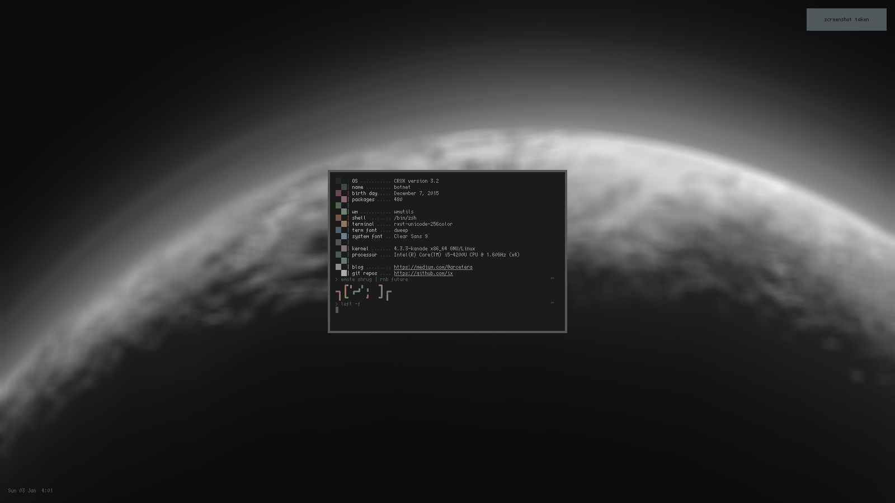

This project is dead as I am now using Openbox rather than wmutils. Feel free to use these scripts as reference, but mind the license.

# wmrc

A simple WM powered by wmutils, comprised of pure POSIX-compliant shell scripts.

## Appearance

## Installation

A simple, automated method of installation will be added later (Void template, CRUX port, Arch PKGBUILD), but not yet. Hold on.

Note that this expects that you run `startx` from a tty, not use a login manager (e.g. `gdm`, `sddm`, etc). 

First off,  you need to compile/install the following:

* wmutils/libwm
* wmutils/core
* wmutils/opt
* sxhkd
* dmenu (or some menu, I use interrobang)
* Any virtual terminal (if your terminal is not properly detected by `tln`, you will have to edit `tln`)

Highly recommended:

* lemonbar
* dash - insanely fast posix-compliant shell. symlink to /bin/sh for best performance in most scripts
* hsetroot - wallpaper
* compton - tearing protection and shadows and such
* dunst - notification daemon

If you don't already have them, copy `sxhkdrc.default` to `~/.config/sxhkd/sxhkdrc`, and copy `xinitrc.default` to `~/.xinitrc`.

Uncomment the features you would like in `.xinitrc`.

Copy `config.default` to `~/.config/wmrc/config`.

Throw all the scripts somewhere in your PATH. Enjoy.

## TODO

* User guide, good documentation
* Add more layouts to dytyl
* Void Linux template and CRUX port

# Known issues

* Please report them!

# Pull requests

If you want to help, please do!
